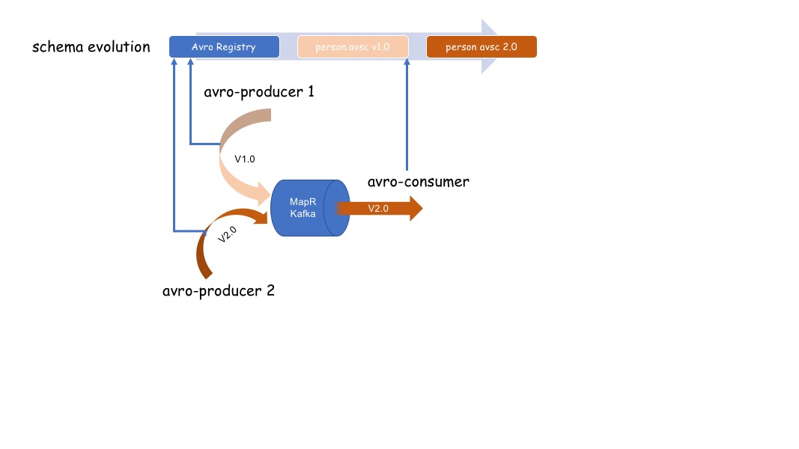

## Schema Evolution Using Spring Cloud Stream + Avro +  MapR Kafka


Service/Producer/Consumer Schema evolution is always challenging. As an architect/developer, I would like to design my service/producer/consumer to be resilient to differing payload schemas.

This problem is becoming more acute in the world of Big Data. Let's explore this problem further. MapR provides great support for building Data Lake. One of the corner stone in building data lake is the "data ingestion". It's always quest of a Data Engineer/developer to build resilient services/data pipe line which can withstand schema changes. But the question is how? 

So, I started exploring how can I build MapR Kafka producer/consumer which is resilient to different payload evolution(s). The outcome of my research is my GitHub project - "mapr-kafka-avro". This project is build using MapR Kafka + Apache Avro + Spring Cloud Stream and demonstrates:

1. Schema Evolution using Spring Cloud Stream based Apache Avro Schema registry. Avro has a JSON like data model, but can be represented as either JSON or in a compact binary form. It comes with a schema description language that describes data (like google protobuff)

2. Spring Cloud Stream based different service/producer having different payload writing to Kafka

3. Spring Cloud Stream based consumer which adapts seamlessly to payload changes.


This project demonstrates schema evolution using following projects:

1. **schema-registry:** Spring Boot style Avro schema registry using Spring Cloud Stream
2. **avro-producer1:** Spring Boot micro-service build using Spring Cloud Stream which creates a _**Person**_ and 
   writes to MapR Kafka Topic using version - v1.0 of _**Person**_ schema
   The Person schema contain following attributes:
   - id
   - name
   - age
   - sex
   - married
3. **avro-producer2:** Spring Boot micro-service build using Spring Cloud Stream which creates a _**Person**_ and 
      writes to MapR Kafka Topic using version - v2.0 of _**Person**_ schema. In version 2 of _**Person**_ attribute
      _**name**_ is split into two parts:
      - firstname (Person(v2.0).firstname = Person(v1.0).name)
      - lastname
      
 ```
  For making things self explainable, above producer will append v1.0 or v2.0. This will helps in visualizing
  schema changes and conumer is not affected
 ```   
 
4. **avro-consumer:** A consumer which is resilient to _**Person**_ schema changes

  


## Merits Of Using Avro For Schema Evolution

1. It has a direct mapping to and from JSON
2. It has a very compact format. The bulk of JSON, repeating every field name with every single record, is what makes JSON inefficient for high-volume usage.
3. It is very fast.
4. It has great bindings for a wide variety of programming languages so you can generate Java objects that make working with event data easier, but it does not require code generation so tools can be written generically for any data stream.
5. It has a rich, extensible schema language defined in pure JSON
6. It has the best notion of compatibility for evolving your data over time.

## Why Schema?

1. Robustness
2. Clarity and Semantics
3. Compatibility
4. Schemas are a Conversation
5. Schemas Eliminate The Manual Labor of Data Science


## Pre-requisite

The project uses MapR sanbox. To install MapR follow steps specified in project - [SpringBootMapR](https://github.com/mgorav/SpringBootMapR)

To install MapR Kafka issue following commands in the MapR sandbox docker container:

```bash

apt-get install mapr-kafka

/opt/mapr/server/configure.sh -R

## Go to MapR Kafka 

root@maprdemo:/opt/mapr/kafka/kafka-1.0.1/config#vi server.properties
advertised.host.name=maprdemo
advertised.port=9092
zookeeper.connect=localhost:5181

## Start MapR Kafka

root@maprdemo:/opt/mapr/kafka/kafka-1.0.1/bin# ./kafka-server-start.sh  ../config/server.properties

```

## Play time

1. Run project _schema-registry_
2. Run project _avro-producer1_
```bash
curl -X POST http://localhost:4444/persons
curl -X POST http://localhost:4444/persons
curl -X POST http://localhost:4444/persons
```
3. Run project _avro-producer2_
```bash
curl -X POST http://localhost:5555/persons
curl -X POST http://localhost:5555/persons
curl -X POST http://localhost:5555/persons
```
4. Run project _avro-consumer_
Following output will generated:
```bash

2018-07-12 23:21:34.924  INFO 30711 --- [container-0-C-1] ication$$EnhancerBySpringCGLIB$$f73d4a84 : {"id": "3cac2e61-5557-4fa7-a511-edefb988ba91-v1.0", "firstname": "Name1", "lastname": "", "age": 22, "sex": 0, "married": false}
{"id": "3cac2e61-5557-4fa7-a511-edefb988ba91-v1.0", "firstname": "Name1", "lastname": "", "age": 22, "sex": 0, "married": false}
2018-07-12 23:21:36.155  INFO 30711 --- [container-0-C-1] ication$$EnhancerBySpringCGLIB$$f73d4a84 : {"id": "e755a123-6bff-4921-9609-8e357e38fa8b-v1.0", "firstname": "Name3", "lastname": "", "age": 24, "sex": 0, "married": false}
{"id": "e755a123-6bff-4921-9609-8e357e38fa8b-v1.0", "firstname": "Name3", "lastname": "", "age": 24, "sex": 0, "married": false}
2018-07-12 23:21:42.358  INFO 30711 --- [container-0-C-1] ication$$EnhancerBySpringCGLIB$$f73d4a84 : {"id": "917fc682-3df6-459b-917d-e09984b0a550-v2.0", "firstname": "Name1", "lastname": "LastName2", "age": 23, "sex": 0, "married": true}
{"id": "917fc682-3df6-459b-917d-e09984b0a550-v2.0", "firstname": "Name1", "lastname": "LastName2", "age": 23, "sex": 0, "married": true}
2018-07-12 23:21:43.678  INFO 30711 --- [container-0-C-1] ication$$EnhancerBySpringCGLIB$$f73d4a84 : {"id": "3340e3f5-4af2-4eeb-850e-3a536fa947a1-v2.0", "firstname": "Name4", "lastname": "LastName5", "age": 26, "sex": 0, "married": false}
{"id": "3340e3f5-4af2-4eeb-850e-3a536fa947a1-v2.0", "firstname": "Name4", "lastname": "LastName5", "age": 26, "sex": 0, "married": false}

```

It can be seen that _*Person*_ version 1.0 & 2.0 has no impact on the consumer and both can exist.


   
